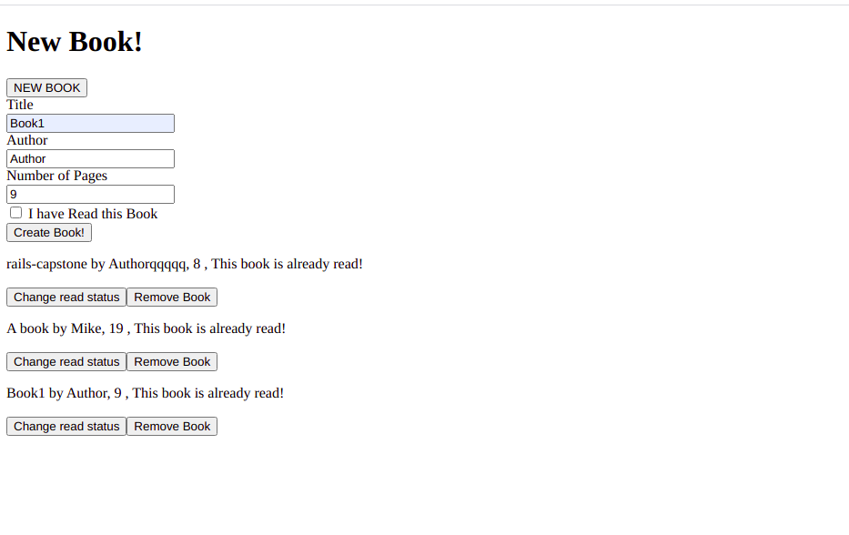

# Library

## Library screenshot

In this project we build a simple library app with js where you can:

- Add books
- Remove Books
- Mark added books as read

## Built With

- JavaScript
- HTML
- CSS

## Getting Started

To set up a local copy of the project

- `git clone https://github.com/wandji20/Book-Library.git`
- `cd Book-Library`

## Live Link of the project
- `https://library-wandji-gunduz.herokuapp.com/`
## Author

👤 **Necmi Gunduz**

- LinkedIn: [Necmi Gunduz](https://www.linkedin.com/in/necmigunduz/)
- Github: [@necmigunduz](https://github.com/necmigunduz/)
- Twitter: [@necmigunduz](https://twitter.com/necm_gun)
- Mail: [necmigunduz@gmail.com](necmigunduz@gmail.com)

👤 **Wandji Bertrand**

- Github: [@wandji20](https://github.com/wandji20)
- Twitter: [@wandjibertrand](https://twitter.com/wandjibertrand)
- Linkedin: [Linkedin](https://www.linkedin.com/in/wandji-bertrand/)

## 🤝 Contributing

Contributions, issues, and feature requests are welcome!

## Show your support

Give a ⭐️ if you like this project!

## Acknowledgments

- To Microverse for their `README` template.

## 📝 License

MIT License Copyright (c) 2021 Wandji and Gunduz Permission is hereby granted, free of charge, to any person obtaining a copy of this software and associated documentation files (the "Software"), to deal in the Software without restriction, including without limitation the rights to use, copy, modify, merge, publish, distribute, sublicense, and/or sell copies of the Software, and to permit persons to whom the Software is furnished to do so, subject to the following conditions: The above copyright notice and this permission notice shall be included in all copies or substantial portions of the Software. THE SOFTWARE IS PROVIDED "AS IS", WITHOUT WARRANTY OF ANY KIND, EXPRESS OR IMPLIED, INCLUDING BUT NOT LIMITED TO THE WARRANTIES OF MERCHANTABILITY, FITNESS FOR A PARTICULAR PURPOSE AND NONINFRINGEMENT. IN NO EVENT SHALL THE AUTHORS OR COPYRIGHT HOLDERS BE LIABLE FOR ANY CLAIM, DAMAGES OR OTHER LIABILITY, WHETHER IN AN ACTION OF CONTRACT, TORT OR OTHERWISE, ARISING FROM, OUT OF OR IN CONNECTION WITH THE SOFTWARE
